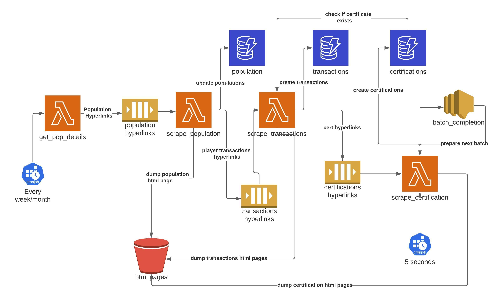

# PSA-Scraping

## Scraping Approach

The first page that needs to be scraped is [this](https://www.psacard.com/pop/basketball-cards/20019). This [link](https://www.psacard.com/pop/basketball-cards/20019) has all the hyperlinks for all the years of Basketball cards.

Going into each year, one will find hyperlinks for all the card sets belonging to the year. For example, this [link] (https://www.psacard.com/pop/basketball-cards/1948/20525) shows the card sets for the year 1948

Now, each of that link (example [link](https://www.psacard.com/pop/basketball-cards/1948/bowman/34069) that belongs to the Bowman collection of the year 1948) actually shows the **population** report that’s of our interest. This page needs to be scraped for the **population**. We can traverse through the years and sets to get **ALL** the **population** data that’s related to basketball cards. An 

Each **population** report has a link to all **transactions** hyperlinked on the **APR** box. Using the APR link will give us the hyperlinks related to all transactions related to every player in that set. For example, to find out all the **transactions** to Ernie Calverley card of Bowman 1948, one can find the link on this [page](https://www.psacard.com/auctionprices/basketball-cards/1948-bowman/34069) which leads us to all transactions of that card in Bowman 1948 in this [link](https://www.psacard.com/auctionprices/basketball-cards/1948-bowman/ernie-calverley/values/299138/). **ALL** the **transactions** can now be collected from this page. 

Fortunately, the **transactions** page also contains the **cert** number for every single transaction. One can use this [endpoint](https://www.psa.com/cert/) and the cert number to get the details of **certification**. Each **transaction** can lead us to a **certification**. Since each basketball card is not traded too many times, the chances that you will run into duplicate **certifications** will be small and one can de-dupe not scraping if it’s already been done. This way you will be able to collect **ALL** the **certifications** data

## Data Pipeline
Now that we figured out how to get the entire data related to population, transactions and certifications, it’s time for the technical implementation. I recommend using AWS services mainly the **Lambda, S3, DynamoDB, SQS, SNS** and **cronjob**. The language for writing the infrastructure code can be written by Python using [aws-cdk](https://aws.amazon.com/cdk/), my favorite alternative when compared to using serverless templates

### Choice of Technology
The reason for choosing **Lambda** and **DyanmoDB** is to avoid creating any servers and have a serverless stack that can be extremely scalable. The cost of using these tables is also extremely cheap. 

**DynamoDB** can support the NoSQL data structure and can help to scale the data model horizontally in case of any changes to the data model. **DynamoDB streams** will also help us identify the changes in the records if certain services need to listen to it. 

### Data Model Diagram

### Get Population Details

The `get_pop_details` lambda will be triggered every week/month based on the refresh of the data needed. Once it gets triggered, we will use `requests` python library to get the data of all basketball population page links. These page links will be posted into the `population_hyperlinks ` queue to be processed by `scrape_population`
Also, the HTML pages need to be stored in S3 and their locations should be mentioned in the table in case the data needs to be reused 

### Scrape Population
`population_hyperlinks` queue will act as a load balancer for the `scrape_population` lambda which can either take batches of the hyperlinks or one at a time to download the population page. 

The population page cannot be downloaded using the `requests` page simply. The population table is actually a dynamically loaded table by javascript. Therefore one needs to use browser to load the page and then read the table. 

For this, we can use headless chrome with `selenium` library to download the population table. The `scrape_population` will load the page and transform the html table to dynamodb records and store it in the `population` table

The `scrape_population` can also use `requests` library to load the page for APR which contains the hyperlinks to all players belonging to the card set for the year. Each player hyperlink will be pushed as a message to `transaction_hyperlinks` queue along with some metadata related to the population it belongs to. 

Also, the HTML pages need to be stored in S3 and their locations should be mentioned in the table in case the data needs to be reused 

### Scrape Transactions

The `transaction_hyperlinks` queue triggers the `scrape_transactions` lambda to take the transaction details in batches or one by one depending on the preference. 

The `scrape_transactions` lambda will use `requests` library to get all the transaction details of each player belonging to the card set and year and store each transaction along with the linked population details in the `transactions` table.

Each player transaction table also contains a certification number, the lambda will check if these certifications already exist in the `certifications` table, otherwise, it will send them to `certifications_hyperlinks` queue. 

Also, the HTML pages need to be stored in S3 and their locations should be mentioned in the table in case the data needs to be reused 

### Scrape Certifications
The challenge here now is to download as many pages as possible but also not hit too many times due to anti-scraping tools limitation. The best way to handle this is to use SNS and cronjob to trigger the `scrape_certification` lambda.

The `scrape_certification` will be triggered every 5 seconds by a cronjob. Once it’s triggered, the lambda will get a batch of URLs from the `certifications_hyperlinks` queue.

If it successfully completes the batch within 5 seconds, it will delete the messages from the queue, create records in the `certifications` table and send a `batch_completion` notification. The `batch_completion` notification will re-trigger the lambda to get the next batch. 

At any point, if any of the records of the batch fails, the lambda will be stopped and the unused and failed hyperlinks will be put back in the queue. The lambda will be triggered after 5 seconds using the cronjob as usual which will be under anti-scraping tools consideration. 

Also, the HTML pages need to be stored in S3 and their locations should be mentioned in the table in case the data needs to be reused 
